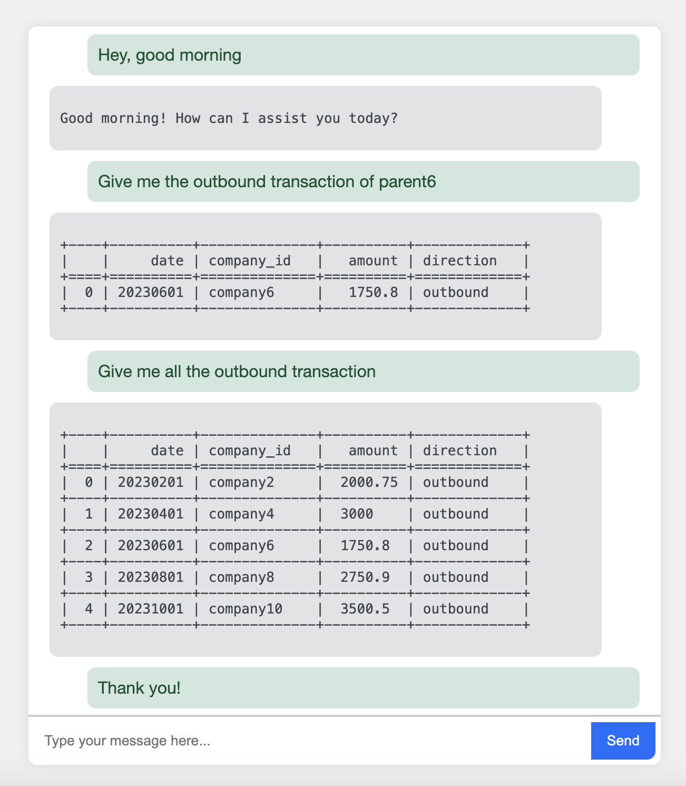

# SQL GenEx V1 Demo

SQL GenEx is a chatbot designed to create and execute SQL queries for custom databases. It simplifies the process of retrieving information from multiple tables without requiring users to understand table schemas, data dictionaries, columns, or other database details. This tool is particularly useful for managers and other non-technical users who can obtain the necessary data using natural language queries.

## Demo



Watch the demo video to see SQL GenEx in action:

<video width="800" controls>
  <source src="images/sql_llm_demo.mp4" type="video/mp4">
  Your browser does not support the video tag. <a href="images/sql_llm_demo.mp4">Download the video</a> instead.
</video>

## Prerequisites

### 1. Create a New Virtual Environment

Conda Environment
```
conda create -n sql_llm
conda activate sql_llm
```
Native Python Virtual Environment
```
python -m venv sql_llm
source sql_llm/bin/activate  # On Windows, use `venv\Scripts\activate`
```
### 2. Install Dependencies
Install the dependencies listed in the `requirements.txt` file:
```
pip install -r requirements.txt
```

## Backend Setup

### 1. Setup Environment Variables
Add your OpenAI API key to the environment:
```
export OPENAI_API_KEY="{your_openai_api_key}"
```
### 2. Start the Backend Server
Navigate to the backend folder where `app.py` is located:
```
cd sql_llm/backend
```
Start the backend server locally on port `8000`:
```
uvicorn app:app --reload --host 0.0.0.0 --port 8000
```
The backend server should now be running at `http://localhost:8000`.

## Frontend Setup

### 1. Install Dependencies
To start a live server locally, open Visual Studio Code (VSCode) and install the `Live Server` extension.

### 2. Start the Frontend Live Server
Navigate to the frontend folder where `index.html`, `script.js`, and `styles.css` are located:
```
cd sql_llm/frontend
```
Open `index.html` in VSCode. On the bottom right corner, click on the `Go Live` button. Ensure you are on the `index.html` file when clicking the `Go Live` button.

## Using SQL GenEx
1. Open your browser and navigate to the live server URL provided by the `Live Server` extension (typically `http://127.0.0.1:5500`).
2. Type a message in the input box and press enter.
3. The chatbot will respond based on the backend server's processing of your input.

## Troubleshooting
- Ensure your backend server and frontend live server are running simultaneously.
- Verify that your OpenAI API key is correctly set in the environment variables.
- Check the console output for any error messages and resolve them accordingly.